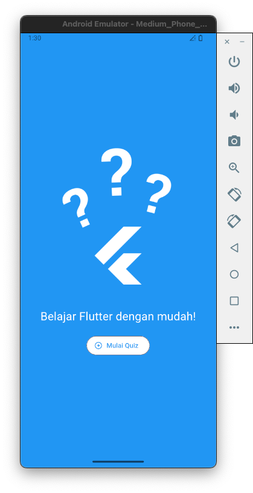
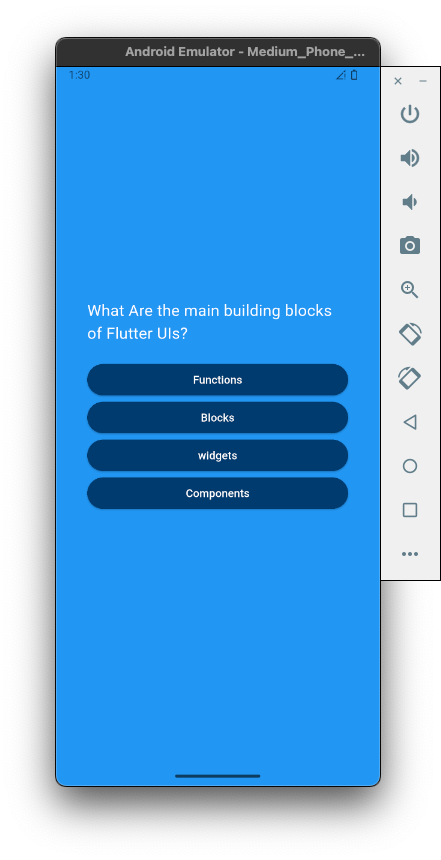
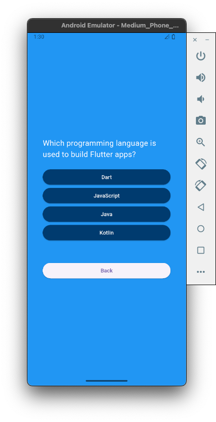
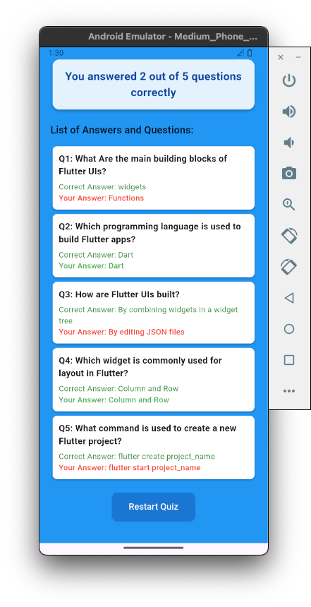

# 📝 Flutter Quiz App


Aplikasi **Quiz Flutter** interaktif dengan pertanyaan pilihan ganda, ringkasan jawaban, dan navigasi yang mudah. Cocok untuk latihan Flutter, UI/UX, dan state management.

---

## 🚀 Fitur Utama

- 🎯 Pertanyaan pilihan ganda dengan jawaban diacak
- ⬅️➡️ Navigasi **Next** & **Back**
- ✅ Jawaban bisa diupdate jika kembali ke pertanyaan sebelumnya
- 📊 Ringkasan akhir:
  - Total jawaban benar
  - Daftar pertanyaan, jawaban benar, dan jawaban user
  - Warna berbeda untuk jawaban benar (hijau) dan salah (merah)
- 🔄 Restart quiz kapan saja

---

## 🖼 Screenshot

### 1️⃣ Start Screen



### 2️⃣ Quiz Tanpa Tombol Back



### 3️⃣ Quiz Dengan Tombol Back



### 4️⃣ Result Quiz



---

## 🗂 Struktur Proyek

lib/
├─ main.dart # Entry point
├─ quiz_question.dart # Layar pertanyaan kuis
├─ result_screen.dart # Layar ringkasan kuis
├─ answer_button.dart # Widget custom tombol jawaban
└─ data/
└─ questions.dart # Daftar pertanyaan & jawaban
assets/
└─ demo/ # Folder screenshot

---

## ⚡ Cara Menjalankan

```bash
git clone https://github.com/username/flutter-quiz-app.git
cd flutter-quiz-app
flutter pub get
flutter run


🎮 Cara Pakai

Pilih jawaban di setiap pertanyaan

Gunakan tombol Next & Back untuk navigasi

Lihat ringkasan di akhir quiz

Tekan Restart Quiz untuk memulai ulang

🤝 Kontribusi

Tambahkan lebih banyak pertanyaan

Tingkatkan tampilan & interaksi UI

Tambahkan animasi atau efek suara

```
